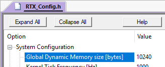
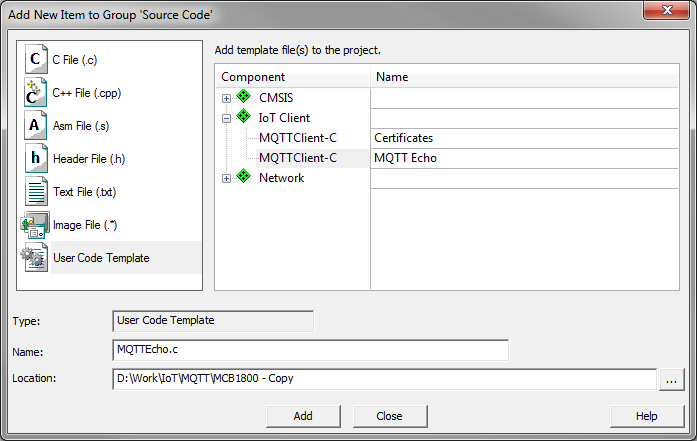

Getting started with Paho MQTT and MDK
======================================

This tutorial explains how to use **MDK** and the **Paho_MQTT** pack to connect your application to a cloud using MQTT protocol.

Prerequisites
-------------
You require a development board with a device that is supported by [CMSIS-Drivers](http://arm-software.github.io/CMSIS_5/Driver/html/index.html). Lots of devices from STMicroelectronics and NXP do have these drivers available. Please consult the [device database](https://www.keil.com/dd2) for a list of devices and development boards.

When you have chosen your device and development board, use [Pack Installer](https://www.keil.com/support/man/docs/uv4/uv4_ca_packinstaller.htm) to download and install the following software packs:

* **MDK-Packs::Paho_MQTT**
* **MDK-Packs::IoT_Socket** v1.0.0 or newer
* **ARM::CMSIS** v5.0.1 or newer
* **ARM::mbedTLS** v1.3.1 or newer
* **Keil::MDK-Middleware** v7.4.0 or newer
* Device family pack for the selected device

**Note**:

* In order to be able to use the MQTT Cloud Connector, you require a MDK-Professional license. &micro;Vision allows you to start a [seven day trial](http://www2.keil.com/mdk5/activation/) from within the tool.
* This tutorial assumes that you know how to work with &micro;Vision (creating projects, adding template code, configuring software components). If not, check out the [MDK Getting Started Guide](https://armkeil.blob.core.windows.net/product/gs_MDK5_4_en.pdf).
* In this tutorial, your MDK installation folder will be referenced as \<INSTALL_FOLDER>. Usually, it is C:\\Keil_v5.

In &micro;Vision
----------------

Follow these steps to create a simple application that connects to the iot.eclipse.org test server using MQTT.

### Create project and select software components
1. Create a new project. Select the device that you are using on your development board.
2. The  Manage Run-Time Environment window opens. Select the following software components:
    * **IoT Client:MQTTClient-C**
    * **IoT Utility:MQTTPacket**
    * **IoT Utility:Socket:MDK Network**
    * **CMSIS:RTOS2:Keil RTX5**
    * **CMSIS:CORE**
    * **Security:mbed TLS**
    * **Network:** make sure to select the variant **MDK-Pro**
    * **Network:Socket:BSD**
    * **Network:Socket:TCP**
    * **Network:Socket:UDP**
    * **Network:Service:DNS Client**
    * **Network:Interface:ETH**
    * **Network:CORE:IPv4 Release**
    * **CMSIS Driver:Ethernet/MAC/PHY (API)** (depending on your hardware)
    * **Device:Startup** (and any other Device dependent components)
    
    Optional (for `printf` debug output on the console):
    * **Compiler:I/O:STDOUT:ITM**

### Configure the software components
1.  Configure mbedTLS: **Security:mbedTLS_config.h**
    * In the Project window, double-click this file to open it. It contains generic settings for mbed TLS and its configuration requires a thorough understanding of SSL/TLS. We have prepared an example file that contains all required settings for a typical MQTT server (tested on iot.eclipse.org). The file available in `<INSTALL_FOLDER>/ARM/Pack/MDK-Packs/PahoMQTT/_version_/config/mbedTLS_config.h`. Copy its contents and replace everything in the project's mbedTLS_config.h file.
2.  If you are using the software components described above, you do not need to configure the Network component. The default settings will work. If you do not have DHCP available in your network, please refer to the [MDK-Middleware documentation](http://www.keil.com/pack/doc/mw/Network/html/index.html) on how to set a static IP address.
3.  Configure RTX5: **CMSIS:RTX_Config.h**
    * If you are using the provided template (see below), you need to set the **System - Global Dynamic Memory size** to at least 10240:<br>
    <br>
    This large amount of dynamic memory is not required for custom projects.
4.  Configure Heap: **startup_\<device>.s**
    * Configure at least 48 KB (0xC000) of heap memory.<br> 
    <br>
    This is required for the mbed TLS certificates.
5.  Configure device specific hardware:
    * Configure the CMSIS Ethernet driver and other device specific components (clock system, I/O, ...) as required. Please consult your device's/board's documentation for more information.

### Add Template code
The **Paho_MQTT** pack includes a code template that can be used to test the connection to a MQTT server. It is configured for iot.eclipse.org test server. In the Project window, right-click "Source Group 1" and select "Add New Item to Group" - "User Code Template", to add user code templates.

1.  MQTT Echo sample code:
    * Add **IoT Client:MQTTClient-C:MQTT Echo**
    <br>
    <br>
2.  Add **CMSIS:RTOS2:Keil RTX5:main** and update:
    * Add an attribute for an increased stack size for the application thread. Sample requires a thread stack size of 8 KB:<br>
      `const osThreadAttr_t app_main_attr = { .stack_size = 8192U };`
    * Change application thread creation (include the attribute defined above):<br>
      `osThreadNew(app_main, NULL, &app_main_attr);`
    * Add an include for the Network library (beginning of file):<br>
      `#include "rl_net.h"`
    * Add a prototype for the example's top level function:<br>
      `extern int MQTTEcho_Test (void);`
    * Add Network initialization in the `app_main` function:<br>
      `uint32_t addr;`<br>
      `netInitialize();`<br>
      `do {`<br>
      &nbsp;&nbsp;`osDelay(500U);`<br>
      &nbsp;&nbsp;`netIF_GetOption(NET_IF_CLASS_ETH | 0, netIF_OptionIP4_Address, (uint8_t *)&addr, sizeof (addr));`<br>
      `} while (addr == 0U);`
    * Add a call to the example's top level function into the `app_main` function after Network initialization (replace the `for` loop):<br>
      `MQTTEcho_Test();`
3.  MQTT Certificates:
    * Add **IoT Client:MQTTClient-C:Certificates**. This adds the file `certificates.h` to the project. This file needs careful editing. The next step explains what to add here. 
    
### Adding your certificates
Previously, you have created a template with certificates and keys for your thing. You need to provide the root CA certificate for the server and optionally the client certificate and key if client authentication is required.
Following is the necessary configuration when connecting to iot.eclipse.org via TLS (secure socket).

1. Use the following `CA_Cert` (DST Root CA X3)<br>
    `"-----BEGIN CERTIFICATE-----\n"`<br>
    `"MIIDSjCCAjKgAwIBAgIQRK+wgNajJ7qJMDmGLvhAazANBgkqhkiG9w0BAQUFADA/"`<br>
    `"MSQwIgYDVQQKExtEaWdpdGFsIFNpZ25hdHVyZSBUcnVzdCBDby4xFzAVBgNVBAMT"`<br>
    `"DkRTVCBSb290IENBIFgzMB4XDTAwMDkzMDIxMTIxOVoXDTIxMDkzMDE0MDExNVow"`<br>
    `"PzEkMCIGA1UEChMbRGlnaXRhbCBTaWduYXR1cmUgVHJ1c3QgQ28uMRcwFQYDVQQD"`<br>
    `"Ew5EU1QgUm9vdCBDQSBYMzCCASIwDQYJKoZIhvcNAQEBBQADggEPADCCAQoCggEB"`<br>
    `"AN+v6ZdQCINXtMxiZfaQguzH0yxrMMpb7NnDfcdAwRgUi+DoM3ZJKuM/IUmTrE4O"`<br>
    `"rz5Iy2Xu/NMhD2XSKtkyj4zl93ewEnu1lcCJo6m67XMuegwGMoOifooUMM0RoOEq"`<br>
    `"OLl5CjH9UL2AZd+3UWODyOKIYepLYYHsUmu5ouJLGiifSKOeDNoJjj4XLh7dIN9b"`<br>
    `"xiqKqy69cK3FCxolkHRyxXtqqzTWMIn/5WgTe1QLyNau7Fqckh49ZLOMxt+/yUFw"`<br>
    `"7BZy1SbsOFU5Q9D8/RhcQPGX69Wam40dutolucbY38EVAjqr2m7xPi71XAicPNaD"`<br>
    `"aeQQmxkqtilX4+U9m5/wAl0CAwEAAaNCMEAwDwYDVR0TAQH/BAUwAwEB/zAOBgNV"`<br>
    `"HQ8BAf8EBAMCAQYwHQYDVR0OBBYEFMSnsaR7LHH62+FLkHX/xBVghYkQMA0GCSqG"`<br>
    `"SIb3DQEBBQUAA4IBAQCjGiybFwBcqR7uKGY3Or+Dxz9LwwmglSBd49lZRNI+DT69"`<br>
    `"ikugdB/OEIKcdBodfpga3csTS7MgROSR6cz8faXbauX+5v3gTt23ADq1cEmv8uXr"`<br>
    `"AvHRAosZy5Q6XkjEGB5YGV8eAlrwDPGxrancWYaLbumR9YbK+rlmM6pZW87ipxZz"`<br>
    `"R8srzJmwN0jP41ZL9c8PDHIyh8bwRLtTcm1D9SZImlJnt1ir/md2cXjbDaJWFBM5"`<br>
    `"JDGFoqgCWjBH4d1QB7wCCZAA62RjYJsWvIjJEubSfZGL+T0yjWW06XyxV3bqxbYo"`<br>
    `"Ob8VZRzI9neWagqNdwvYkQsEjgfbKbYK7p2CNTUQ\n"`<br>
    `"-----END CERTIFICATE-----\n";`<br>
2. Leave `ClientCert` unchanged (not used)<br>
3. Leave `ClientKey` unchanged (not used)<br>

### Optional: Configure debug
The MQTT Echo sample code is prepared to output `printf` statements for debugging purposes. To show these effectively, you can use the software component **Compiler:I/O:STDOUT:ITM** to show the messages in the [Debug printf](http://www.keil.com/support/man/docs/uv4/uv4_db_dbg_serialwin.htm) window. To enable this output, do the following:

1.  Open the  Options for target dialog (**Alt+F7**).
2.  Go to the **C/C++** tab and enable mbedTLS debug messages by adding the following global define to the C pre-processor:<br>
    `MBEDTLS_MSG_INFO=1`<br>
3.  Go to the **Debug** tab. Select the debug adapter that is connected to your target and configure these **Settings**:
    * **Debug** tab: Set **Port** to **SW**.
    * **Trace** tab: Set the **Core Clock** to the system clock of your target, Select **Trace Enable** and set make sure that **ITM Stimulus Port 0** is enabled:<br>


### Run/debug the application
MQTT Echo is a simple application which:
 - connects to iot.eclipse.org test server
 - subscribes to a topic "MDK/sample/#"
 - publishes messages to previously subscribed topic
 - displays messages received back (echo)

1.   Build the application (**F7**) and  download (**F8**) to target.
2.  Enter  debug (**CTRL+F5**) and  run (**F5**) the application on the target and monitor the console output via  **Serial Window - Debug (printf) Viewer**. You should see something similar:
    ```
    . Seeding the random number generator... ok
    . Loading the CA root certificate ... ok (0 skipped)
    . Connecting to iot.eclipse.org/8883... ok
    . Setting up the SSL/TLS structure... ok
    . Performing the SSL/TLS handshake... ok
      [ Protocol is TLSv1.2 ]
      [ Ciphersuite is TLS-ECDHE-RSA-WITH-AES-256-GCM-SHA384 ]
      [ Record expansion is 29 ]
    . Verifying peer X.509 certificate... ok
    MQTT Connected
    Message arrived on topic MDK/sample/a: message number 1
    Message arrived on topic MDK/sample/a: message number 2
    Message arrived on topic MDK/sample/a: message number 3
    Message arrived on topic MDK/sample/a: message number 4
    Message arrived on topic MDK/sample/a: message number 5
    Message arrived on topic MDK/sample/a: message number 6
    Message arrived on topic MDK/sample/a: message number 7
    Message arrived on topic MDK/sample/a: message number 8
    Message arrived on topic MDK/sample/a: message number 9
    Message arrived on topic MDK/sample/a: message number 10
    . Closing the connection... done
    MQTT Disconnected
    ```
